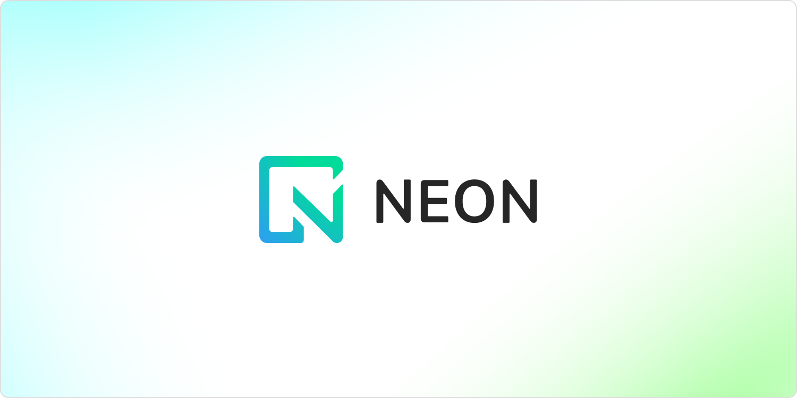

# AWS Workshop: Overcoming RDS Bottlenecks & Enhancing Development Workflows with Neon <!-- CHANGE THIS TO BE THE TITLE OF YOUR WORKSHOP -->
 

 

## Welcome

In this 120-minute workshop, we’ll show you how to boost your development speed by integrating Neon into your existing AWS RDS Postgres setup. While RDS remains a trusted choice for production, it falls short in development experience. Neon, a serverless PostgreSQL solution with powerful database branching, offers a dev-friendly alternative for hosting your development and testing environments, so you improve your workflows and team collaboration without the need for disruptive production migrations. 

**During the workshop, we’ll walk you through:**
1. Setting up Neon as your development environment
2. Automating data transfer from RDS to Neon using ``pg_dump`` and ``GitHub Actions``
3. Efficiently migrating changes back to RDS

 

We’ll guide you step-by-step through setting up Neon as your development environment, automating data transfer from RDS to Neon using ``pg_dump`` and GitHub Actions and how to efficiently migrate changes back to RDS. By the end, you’ll be equipped to iterate faster, collaborate better, and reduce costs—all while keeping your production database stable on RDS.

  
 

{}
The examples and sample code provided in this workshop are intended to be consumed as instructional content. These will help you understand how various AWS services can be architected to build a solution while demonstrating best practices along the way. These examples are not intended for use in production environments.
{}